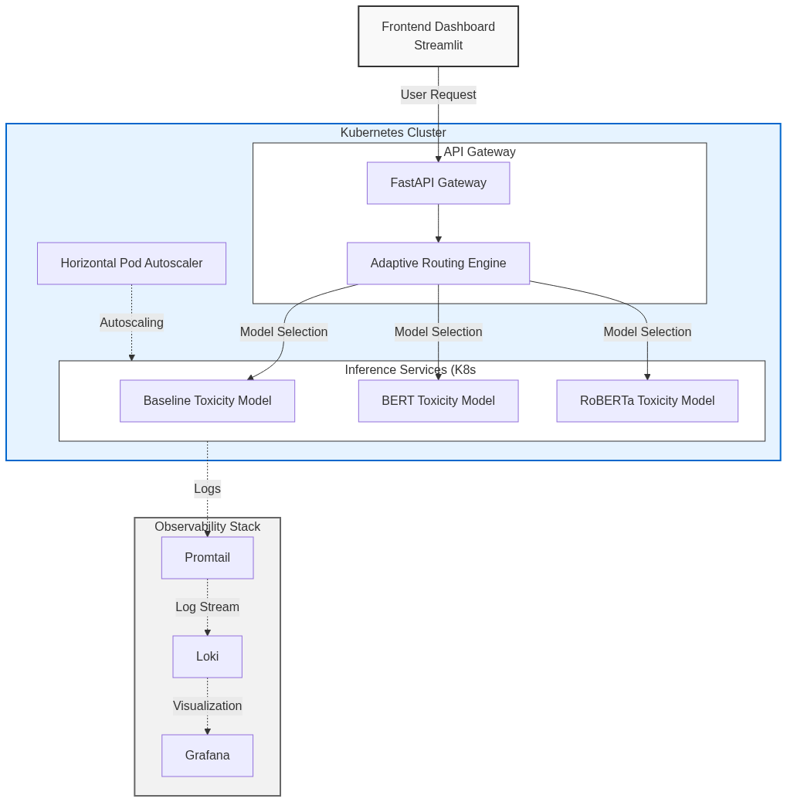
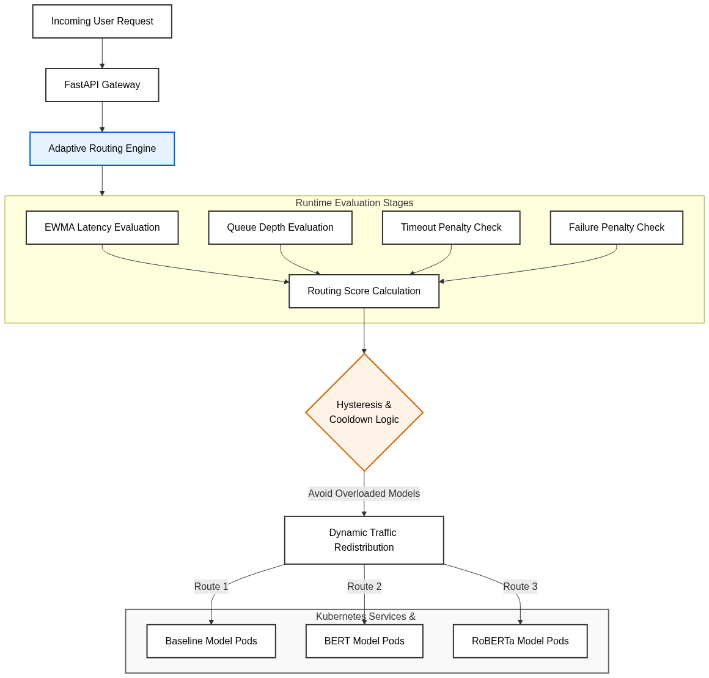

# Scalable NLP Inference System using Kubernetes

[](https://www.python.org/downloads/)
[](https://fastapi.tiangolo.com/)
[](https://kubernetes.io/)
[](https://www.docker.com/)
[](https://grafana.com/)
[](https://www.ansible.com/)
[](https://www.jenkins.io/)
[](https://k6.io/)
[](https://opensource.org/licenses/MIT)

An enterprise-grade, cloud-native Machine Learning Operations (MLOps) platform demonstrating distributed natural language processing (NLP) inference. This system serves multiple toxicity detection models (Baseline, BERT, RoBERTa) orchestrated by a custom-built Adaptive API Gateway, deployed on Kubernetes, and monitored by a lightweight observability stack.

---

## 📖 Project Overview

Modern NLP transformer models are notoriously resource-intensive. When deploying these models at scale, traditional static load balancing often leads to queue congestion and high tail-latencies (P95). 

This project solves this by introducing a **Latency-Aware Adaptive Routing Engine**. The gateway mathematically evaluates real-time queue depth and Exponentially Weighted Moving Average (EWMA) latency to intelligently distribute incoming requests across varying sizes of ML models. This ensures high throughput and latency stability under sustained traffic spikes, while Kubernetes Horizontal Pod Autoscalers (HPA) seamlessly provision new replicas in the background.

## ✨ Key Features

- **Distributed Microservices Architecture**: Distinct, containerized pods for FastAPI Gateway, Baseline Model, BERT, and RoBERTa.
- **Production Adaptive Routing**: Intelligent load balancing using EWMA latency smoothing, queue depth analysis, hysteresis thresholds, and cooldown windows.
- **Kubernetes Self-Healing & Autoscaling**: Integrated `metrics-server` driving Horizontal Pod Autoscalers (HPA) alongside automated failover circuit breakers.
- **Lightweight Observability Stack**: Grafana, Loki, and Promtail (replacing heavy ELK stacks) for real-time log aggregation and performance visualization.
- **Enterprise Automation**: Fully automated infrastructure provisioning via **Ansible** and CI/CD pipelines via **Jenkins**.
- **Experimental Benchmarking**: Built-in Streamlit dashboard and `k6` load-test suites to actively benchmark and export CSV metrics comparing Adaptive vs. Static routing.

---

## 🏛 System Architecture



### Adaptive Routing Workflow
The API Gateway evaluates the cluster health upon every request. Rather than oscillating violently during micro-stutters, the router utilizes a `0.95` decay penalty, a `15%` hysteresis threshold, and a `3-second` freeze window to guarantee production stability.



---

## 📂 Repository Structure

The repository follows standard cloud-native structure guidelines:

```text
.
├── ansible/               # Ansible playbooks (deploy, status, cleanup)
├── ci-cd/                 # Jenkinsfile and CI/CD pipeline definitions
├── diagrams/              # High-res architecture diagrams
├── docs/                  # Extensive documentation guides
├── frontend/              # Streamlit Research Dashboard
├── gateway/               # FastAPI Router and ML Worker services
├── k8s/                   # Kubernetes Manifests (Deployments, Services, HPA, Secrets)
└── load-test/             # k6 benchmarking scripts (moderate, stress, queue-pressure)
```

---

## 🚀 Getting Started

To ensure a seamless setup, we have modularized the documentation. Please follow the guides in order:

1. **[Installation Guide](docs/INSTALLATION.md)**: System requirements, dependencies, and environment setup.
2. **[Running the Project](docs/RUNNING_THE_PROJECT.md)**: Step-by-step execution to spin up the cluster and access the UI.
3. **[Ansible Deployment Guide](docs/ANSIBLE_GUIDE.md)**: How to automate infrastructure provisioning.
4. **[Jenkins CI/CD Guide](docs/JENKINS_GUIDE.md)**: Setting up continuous integration and automated rollouts.
5. **[Tech Stack Documentation](docs/TECH_STACK.md)**: Deep dive into why each technology was chosen.
6. **[Troubleshooting](docs/TROUBLESHOOTING.md)**: Solutions to common Kubernetes, Minikube, and Docker issues.

---

## Environment and Dependency Versions

The project was developed and tested using the following software versions.

| Component | Version |
|---|---|
| Python | 3.11 |
| Docker Desktop | 28.x |
| Minikube | v1.35+ |
| Kubernetes (kubectl) | v1.32+ |
| Helm | v3.17+ |
| Streamlit | 1.45+ |
| FastAPI | 0.115+ |
| Transformers | 4.51+ |
| PyTorch | 2.7+ |
| Grafana | 11.x |
| Loki | 3.x |
| Promtail | 3.x |
| Jenkins | 2.x |
| Ansible | 11.x |
| k6 | 1.0+ |

> Note: Minor version differences may still work, but the above versions were used during development, benchmarking, and experimentation.


## 📊 Benchmarking & Autoscaling Results

### Static vs Adaptive Routing Comparison
By utilizing `k6` to simulate 200 concurrent users (`load-test/k6/queue-pressure-test.js`), we observed the following under our Minikube deployment:

* **Static Routing**: Suffers from queue congestion as heavier models (RoBERTa) bottleneck the round-robin sequence, artificially inflating cluster P95 latency.
* **Adaptive Routing**: The EWMA Gateway detects the RoBERTa congestion in real-time, opens the hysteresis threshold, and dynamically bleeds the excess traffic to the faster Baseline model, preserving throughput and stabilizing tail latency.

### Resiliency Demonstration
The system guarantees zero-downtime inference. By executing `demo-resiliency.ps1`, a worker pod is violently terminated. The Gateway instantly catches the connection timeout, opens the circuit breaker, applies a mathematical failure penalty to the dead route, and redirects all traffic to surviving replicas while Kubernetes natively spins up a replacement pod in the background.

---

## 🔮 Future Improvements

- **GPU Acceleration**: Migrating the `transformers` pipeline to leverage CUDA nodes for massive throughput increases.
- **gRPC Integration**: Replacing HTTP/JSON transport between the Gateway and Worker pods with Protocol Buffers for lower serialization overhead.
- **Prometheus Integration**: Expanding the metrics pipeline to include native Prometheus scraping for highly granular HPA custom metrics.

---

## 👨‍💻 Contributors
Developed as a comprehensive MLOps Systems Engineering project demonstrating scalable NLP architectures, Kubernetes orchestration, and intelligent API gateway design.
