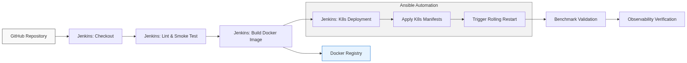

# Jenkins CI/CD Integration Guide

To ensure high code quality and zero-downtime deployments, this project uses [Jenkins](https://www.jenkins.io/) to implement a robust Continuous Integration and Continuous Deployment (CI/CD) pipeline.

The pipeline definition is stored in `ci-cd/Jenkinsfile`.

---

## 🛠 Pipeline Workflow Architecture



The Jenkins pipeline automatically executes the following rigid stages upon every code commit:

### 1. Checkout & Linting
The pipeline clones the latest repository branch and runs Python syntax validation across the FastAPI Gateway and Streamlit Frontend to catch catastrophic failures before building.

### 2. Docker Image Construction
The system builds a lightweight Docker container encapsulating the `transformers` models and the FastAPI routing engine. 

### 3. Secure Registry Push
Using the `dockerhub-credentials` securely stored in Jenkins Credentials Manager, the pipeline authenticates to DockerHub and pushes the freshly tagged image (`v$BUILD_ID` and `latest`).

### 4. Kubernetes Orchestration
The pipeline utilizes `kubectl` to natively apply the latest YAML manifests. It deploys Kubernetes Secrets, Updates Deployments, configures Services, and patches Horizontal Pod Autoscalers (HPA).

### 5. Zero-Downtime Rolling Restarts
To apply the new images without dropping active user requests, Jenkins executes:
```bash
kubectl rollout restart deployment fastapi-router toxic-baseline toxic-bert toxic-roberta
```
The pipeline actively waits and monitors the deployment condition until all new replica pods are reporting healthy (`1/1 READY`), ensuring the cluster is never left in an ambiguous state.

### 6. Automated Smoke Testing
Before marking the deployment as successful, Jenkins natively invokes `k6`. It runs `load-test/k6/baseline.js` directly against the live cluster to verify that the Adaptive Router is correctly handling sustained HTTP traffic.

---

## ⚙️ Setting Up Jenkins Locally

1. Install Jenkins on your local machine or run it via a Docker container.
2. Install the necessary plugins:
   - **Docker Pipeline**
   - **Credentials Binding Plugin**
3. Create a Global Credential:
   - **ID**: `dockerhub-credentials`
   - **Username**: Your DockerHub Username
   - **Password**: Your DockerHub Password/Access Token
4. Create a new **Pipeline Item**, point it to your local Git repository path, and specify `ci-cd/Jenkinsfile` as the script path.
5. Setup a Git webhook (or local SCM polling) to trigger the build automatically on commits.

---

## 💡 How CI/CD Integrates with Kubernetes

Because Minikube acts as a fully compliant Kubernetes control plane, Jenkins uses standard `kubectl` binaries to interact with the API Server. This represents a true production GitOps model: code changes merged into Git automatically map to declared infrastructure changes inside Kubernetes, completely decoupling the developers from manual deployment tasks.
